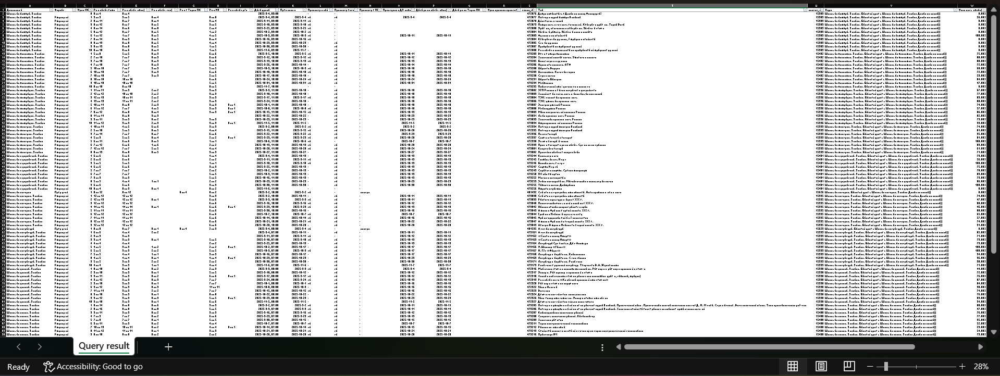

# 🎓 Инструмент для частичной автоматизации написания отчетов по успеваемости (с использованием Python, Pandas)

**Самостоятельный инициативный проект, разработанный для повышения эффективности и удобства работы по написанию отчетов**

---

### 🎯 Контекст и Цель

Этот проект был разработан мной **инициативно** в свободное время как **инженерное решение** внутренней операционной проблемы.

> **Проблема:** Рутинное ручное форматирование "сырых" Excel-отчетов по успеваемости занимало много времени, отвлекая от основной работы с учащимися.
>
> **Цель:** Создание **универсального, самодостаточного** инструмента на Python для автоматического преобразования неструктурированных данных в **готовый к экспорту, отсортированный и читаемый** отчет.

**Результат:** Скрипт выступает как технический инструмент, помогающий наставнику сосредоточиться на сущностной работе с учеником, а не на рутинном форматировании данных для написания отчетов.

---

### 🚀 Обзор Функционала

***Успеваемость_Универсальный.py*** — это единый Python-скрипт, предназначенный для **полной автоматизации** обработки Excel-отчетов по успеваемости с использованием библиотеки **Pandas**.

1.  **Универсальная Обработка:** Одним запуском обрабатываются два типа отчетов, которые скрипт ищет автоматически в папке *«Загрузки» («Downloads»)*:
    * Отчеты по домашней работе (**ДЗ** — файлы с паттерном `_дз.xlsx`).
    * Отчеты по проверочным работам (**ПР** — файлы с паттерном `_пр.xlsx`).
2.  **Интеллектуальный Анализ:** Скрипт автоматически определяет анализируемый период (текущая/предыдущая учебная неделя), включая настраиваемый буфер дней.
3.  **Логика Фильтрации и QA:**
    * **ДЗ:** Работы сортируются по **убыванию успешности**. Успешность считается (или берется из отчета) только для уроков, где **выполнено $\ge 50\\%$ ДЗ** или **не выполнено всего одно задание** (актуально для обхода известных багов исходной системы).
    * **ПР:** Фильтрует все виды работ, оставляя только фактические «долги» (невыполненные работы) и работы, сданные в анализируемом окне.
4.  **Форматирование и Экспорт:**
    * Удаляется бо́льшая часть нерелевантных столбцов.
    * Рассчитывается средняя успешность по дисциплинам, с группировкой и подавлением дублирования названия дисциплины в итоговом отчете.
    * Преобразованный отчет готов к копированию (первых 4-х столбцов) и вставке в итоговый документ.
5.  **Управление Файлами:** После успешной обработки исходные файлы **автоматически перемещаются в Корзину**.

#### Скриншоты до и после обработки отчета по успеваемости скриптом, пример результата.

| До (Сырые данные) | После (Обработанный отчет) |
| :---: | :---: |
|  |  |
|  |  |
### 💻 Требования к Запуску

Python 3 (3.6+) и зависимости:

```bash
pip install pandas openpyxl send2trash
